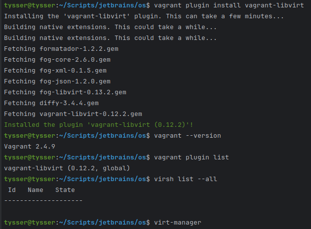
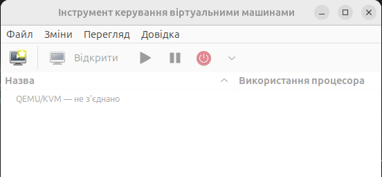
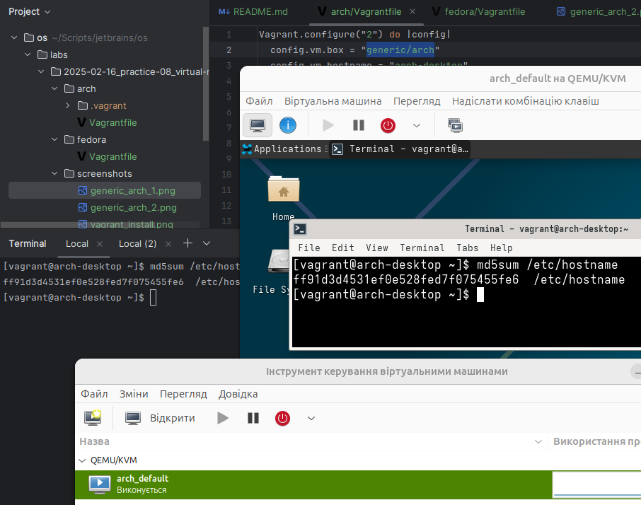
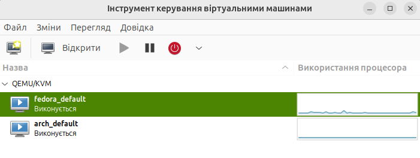

# Практична робота 08 - Virtual Machines

## Завдання
- Завантажити 2 ISO-образи ОС
- Створити 2 віртуальні машини (у мене: Arch Desktop + Fedora Workstation)
- Виконати `md5sum /etc/hostname` та довести унікальність
- Зробити скріншоти(`screenshots/`)

## Ресурси

- [vagrant_downloads](https://developer.hashicorp.com/vagrant/downloads)
- [vagrantfile](https://developer.hashicorp.com/vagrant/docs/vagrantfile)
- [vagrant-libvirt](https://vagrant-libvirt.github.io/vagrant-libvirt/)
- [discover Vagrant Boxes](https://portal.cloud.hashicorp.com/vagrant/discover)
  - Знайти OS бокс під `libvirt`
  - | ОС     | Box                |
    |--------|--------------------|
    | Arch   | `generic/arch`     |
    | Fedora | `generic/fedora39` |
- [virt-manager](https://virt-manager.org/)
- [bridge-utils](https://manpages.debian.org/unstable/bridge-utils/brctl.8.en.html)
- [libvirt-clients](https://manpages.debian.org/trixie/libvirt-clients/virsh.1.en.html)
- [libvirt-daemon-system](https://manpages.debian.org/bullseye/libvirt-daemon/libvirtd.8.en.html)
- [qemu-kvm](https://linux.die.net/man/1/qemu-kvm)

## KVM

### Налаштовуємо гіпервізор

```bash
# В Ubuntu гіпервізор KVM вбудований
lsmod | grep kvm

sudo apt update
sudo apt install -y qemu-kvm libvirt-daemon-system libvirt-clients bridge-utils virt-manager

# Додаємо юзера до груп 
sudo usermod -aG libvirt $USER # доступ до libvirt (virt-manager, virsh, VMs)
sudo usermod -aG kvm $USER # # доступ до апаратної віртуалізації (KVM)

# Далі перезайти в систему або оновити
newgrp libvirt
newgrp kvm

# перевірити
groups

# повинно бути
# <your_user> ... libvirt kvm ...
```

- `usermod` - змінює параметри користувача
- `-aG` - add to Groups (додати до груп, не прибрати з інших)
- `libvirt`(`kvm`) - група, яка має право керувати демоном `libvirtd`
- `$USER` - ім'я поточного користувача

| Компонент               | Опис                                                |
|-------------------------|-----------------------------------------------------|
| `qemu-kvm`              | запуск віртуальних машин з апаратною віртуалізацією |
| `libvirt-daemon-system` | демон керування VM                                  |
| `libvirt-clients`       | CLI (`virsh`, `virt-install`)                       |
| `bridge-utils`          | мережевий бридж, VM у тій самій мережі що й хост    |
| `virt-manager`          | GUI для перегляду і керування VM                    |

### Налаштовуємо Vagrant

**Ставимо Vagrant та плагін для KVM:**

```bash
# https://developer.hashicorp.com/vagrant/downloads
wget -O - https://apt.releases.hashicorp.com/gpg | sudo gpg --dearmor -o /usr/share/keyrings/hashicorp-archive-keyring.gpg
echo "deb [arch=$(dpkg --print-architecture) signed-by=/usr/share/keyrings/hashicorp-archive-keyring.gpg] https://apt.releases.hashicorp.com $(grep -oP '(?<=UBUNTU_CODENAME=).*' /etc/os-release || lsb_release -cs) main" | sudo tee /etc/apt/sources.list.d/hashicorp.list
sudo apt update && sudo apt install vagrant

vagrant plugin install vagrant-libvirt

vagrant --version
vagrant plugin list
virsh list --all
virt-manager
```

Якщо потребує оновити заголовки `dev-пакетів` для `libvirt`, `Ruby` чи інших залежностей, перед `vagrant plugin install vagrant-libvirt` треба оновити наступні пакети:

```bash
sudo apt install -y \
    libvirt-dev \
    ruby-dev \
    build-essential \
    qemu-system \
    qemu-utils \
    libxslt-dev \
    libxml2-dev \
    zlib1g-dev \
    ebtables \
    dnsmasq-base \
    libguestfs-tools
```

Після цього все повинно бути ок:




## Будуємо структуру

```
2025-02-16_practice-08_virtual-machines/
     ├─ arch/
     │   └─ Vagrantfile
     ├─ fedora/
     │   └─ Vagrantfile
     ├─ multi-vm-example/
     └─ screenshots/
README.md
```

- Дізнаємось інтерфейс для bridge

  ```bash
  ip -br link
  ```

- та додаємо у Vagrantfile:

  ```yaml
    config.vm.network "public_network", dev: <"ваш інтерфейс">
  ```

- запускаємо
```bash
cd arch
vagrant up --provider=libvirt

cd ../fedora
vagrant up --provider=libvirt

# Якщо зміни у Vagrantfile, треба перезібрати - дестроємо
vagrant destroy -f

# Start virt-manager
virt-manager
```

## Команди перевірки

```bash
vagrant ssh
md5sum /etc/hostname

# Або через GUI у virt-manager
```

## Результат:

  - ### generic/arch

    

  - ### generic/fedora38

    

    

