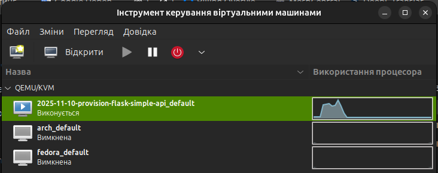
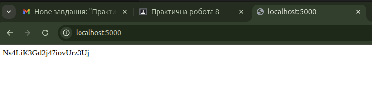

# Практична робота 8

**Основи програмної інженерії**

---

## Мета:

- Налаштування середовища та створення базового програмного забезпечення
1) Встановити віртуальну машину
2) Встановити пакети 
3) Створити робочу директорію

```bash
mkdir python-app
cd python-app/
```

5) Створити віртуальне середовище

```bash
python3 -m venv .env
source .env/bin/activate
```

5) Встановити флакс та `shortuuid`

```bash
pip install flask shortuuid
```

6) Створити файл `main.py` та вписати наступний код

```python
from flask import Flask
import shortuuid

app = Flask(__name__)

@app.route("/")
def hello_world():
    short_id = shortuuid.uuid()
    return short_id

if __name__ == '__main__':
  app.run(host='0.0.0.0')
```

7) Запустити програму

```bash
python main.py
```

8) Відкрити посилання за адресою вказаною в аплікації

9) Скопіювати UUID та вставити в форму

### Виконання:
- Виконання роботи було автоматизовано за допомогою Vagrant і `libvirt`.
- Створено скрипт-провіжинг(`provision.sh`), який автоматично розгортає віртуальну машину `Ubuntu`, встановлює необхідні пакети, середовище `Python` та `Flask`-додаток, і запускає його без ручного втручання.

- Скрипт-провіжинг робимо виконуваним:

```bash
chmod +x provision.sh
```

- Підіймаємо віртуальну машину:

```bash
vagrant up
```

- Якщо потрібно повністю перезібрати середовище:

```bash
vagrant destroy -f
```





